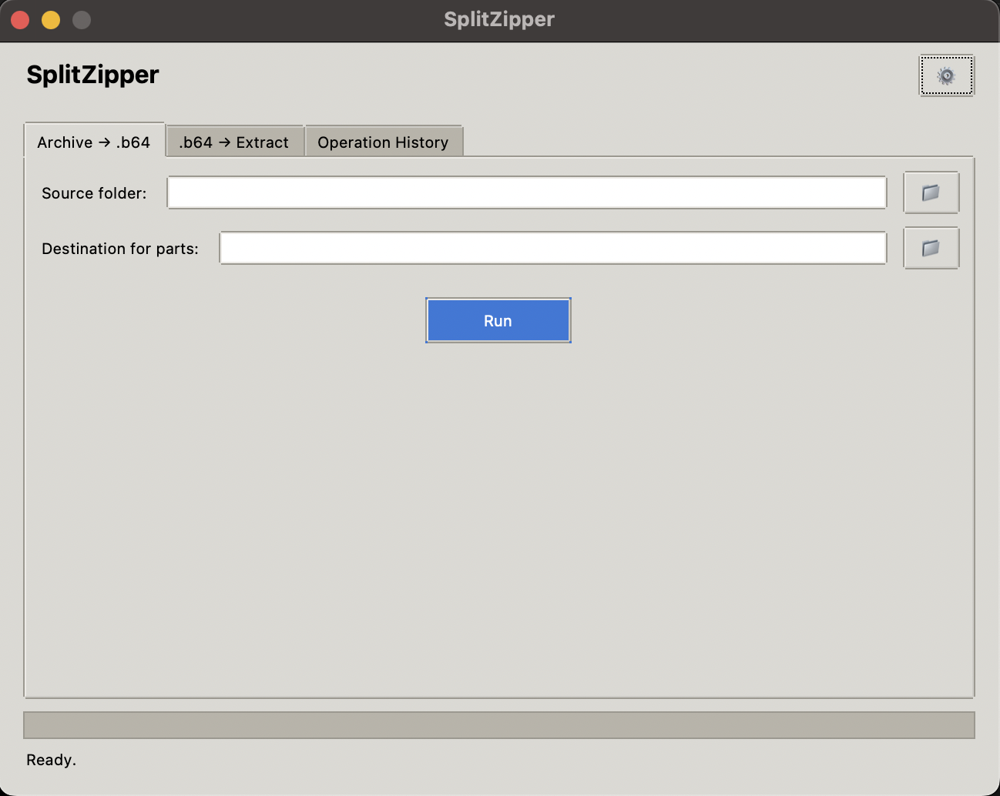

# SplitZipper

SplitZipper is a desktop utility that archives a folder, splits the archive into fixed-size parts, encodes each part in Base64 (or a custom extension), and re-assembles and extracts on demand—designed to drastically speed up email delivery under strict antivirus scanning.



> **Why?**
> In corporate environments or under strict security policies, mail gateways deeply inspect attachments, significantly delaying large ZIP files. SplitZipper helps by:
> Bypassing deep antivirus inspection — encoded parts appear as plain text files.
> Staying within attachment-size limits (default ~16 MiB) to avoid rejection.
> Reducing delivery failures — smaller, text-encoded chunks pass filters faster with fewer false positives.

## Features

* **One‑click archive**: Select any folder—SplitZipper will create a ZIP, split it into parts (configurable size, default ~16 MiB), Base64-encode each part (or use your chosen file extension), and save them into a subfolder if more than one part is generated.
* **One‑click restore**: Point to a folder containing encoded parts—SplitZipper will join, decode, and extract the original ZIP contents. If the ZIP contained multiple files, they are placed into a subfolder named after the archive.
* **Custom chunk size**: Default chunk size is 16 MiB (before Base64). In Settings, you can pick any size (1 MiB–1024 MiB).
* **Localization (English & Russian)**: The entire UI can switch between English and Russian. All text resources live in a separate localization.py file.
* **Operation history**: The “History” tab displays the last 50 archive/restore actions with timestamp, operation type, source path, destination path, and status. History is persisted in ~/.splitzipper_history.json.
* **Settings persistence**: Any changes you make in Settings (chunk size, language, extension) are saved to ~/.splitzipper_settings.json and restored on next launch.
* **Bypass antivirus slowdowns**: Encoded chunks are treated as text, avoiding deep content scanning.
* **Flexible chunk size**: Default is ~16 MiB, but can be adjusted in code or via future UI options.
* **Modern Tkinter UI**: Tabbed interface, progress bar, status messages; all heavy operations run in background threads to keep the GUI responsive.
* **Dependency‑free**: Only Python 3.10+ standard library, no external packages.

## Usage

Clone the repository

```bash
git clone https://github.com/vshulcz/splitzipper.git
```

Run locally

```bash
python main.py
```

Alternatively, install as a package:

```bash
pip install .
splitzipper
```

## License & Contribution

SplitZipper is released under the MIT License. Contributions and pull requests are welcome—feel free to open an issue or PR on GitHub.